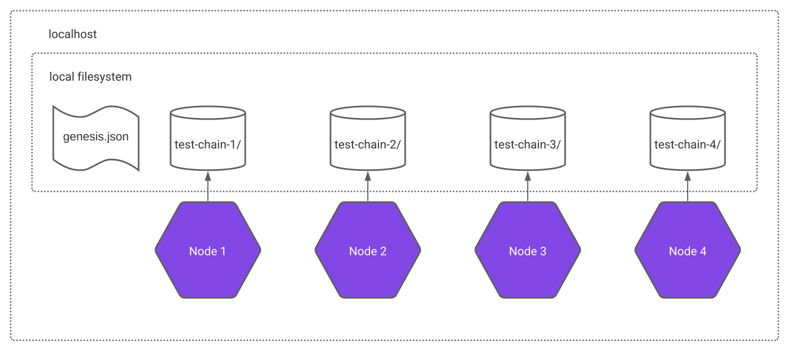

# Polygon Edge

A local setup with 4 nodes.



## Steps

###  1. Initialize data folders for IBFT and generate validator keys

In order to get up and running with IBFT, you need to initialize the data folders, one for each node:


```
docker-compose -f docker-composer/polygon-edge/docker-compose-setup1.yml
```

The instances in this docker compose will print the validator key, bls public key and the [node ID](https://docs.libp2p.io/concepts/peer-id/). You will need the Node ID of the first node for the next step. The output will be like the following:

```
polygon-edge-node-4-1  | [SECRETS INIT]
polygon-edge-node-4-1  | Public key (address) = 0xf61638631f61F2c1CD14dB2151Dc855C15434E23
polygon-edge-node-4-1  | BLS Public key       = 0xa9cf017b852bd588b8632b860e54b24d594d351760e3fab0340407819b9f6a4c420c38520a2f641b409b28b1924a15d9
polygon-edge-node-4-1  | Node ID              = 16Uiu2HAmQv3268ACvmZDk2EpawfFsmfyC9s7agSjFcS1akEmfeYX
polygon-edge-node-4-1  | 
polygon-edge-node-2-1  | 
polygon-edge-node-2-1  | [SECRETS INIT]
polygon-edge-node-2-1  | Public key (address) = 0x0B88F092B11374c99e654f9cFd873d580Ae8B334
polygon-edge-node-2-1  | BLS Public key       = 0xb3c479ba203c85d11241f2c38acdb92c64332bfcc3ca0195abc6f3ee21a164d5f8e7b3a50149cfe72af6f64fda993589
polygon-edge-node-2-1  | Node ID              = 16Uiu2HAmUHbJbfnVrmjrLZVfmnzmH57oqfkVgH2MQrBjEhWDMEfL
polygon-edge-node-2-1  | 
polygon-edge-node-3-1  | 
polygon-edge-node-3-1  | [SECRETS INIT]
polygon-edge-node-3-1  | Public key (address) = 0xBfd7aA15FF46797C79Ab10970441BeB0591ac4E5
polygon-edge-node-3-1  | BLS Public key       = 0x85b648ced892850b3e3ce50b2352c68bdd9ae50722d251c0da675114c6aafc05bedd9840109316f57cd405e6eab8af48
polygon-edge-node-3-1  | Node ID              = 16Uiu2HAmJfDXQbu5eR5hmmzSBtxEFQoiZjpyy3ThmRRb9nzZXSwZ
polygon-edge-node-3-1  | 
polygon-edge-node-1-1  | 
polygon-edge-node-1-1  | [SECRETS INIT]
polygon-edge-node-1-1  | Public key (address) = 0xc51881494d2351665F10D8F8E9fb95c0384432C0
polygon-edge-node-1-1  | BLS Public key       = 0xa042b1ceddfe51e7462380d23bdac6e3d5668f4ff1718302984c4f558d96a52ecb9946ebfd8353c6cd51b08e6ae0e943
polygon-edge-node-1-1  | Node ID              = 16Uiu2HAmSbE2RCKTCdkybNEfGp57uMStaqVPf7jG66BW72ssBVFF
```

**Save the BLS public key**
*If the network is running with BLS, which it is by default, the BLS public key is required for proposing in the PoA mode and for staking in the PoS mode. Polygon Edge only saves the BLS private key, it is the responsibility of the user to preserve the BLS public key.*


###  2. Prepare the multiaddr connection string for the bootnode


For a node to successfully establish connectivity, it must know which bootnode server to connect to in order to gain information about all the remaining nodes on the network. The bootnode is sometimes also known as the rendezvous server in p2p jargon.

bootnode is not a special instance of the polygon-edge node. Every polygon-edge node can serve as a bootnode, but every polygon-edge node needs to have a set of bootnodes specified which will be contacted to provide information on how to connect with all remaining nodes in the network.

To create the connection string for specifying the bootnode, we will need to conform to the multiaddr format: `/ip4/<ip_address>/tcp/<port>/p2p/<node_id>`

**YOU NEED TO SPECIFY AT LEAST ONE BOOTNODE TO START A NODE**
*At least one bootnode is required, so other nodes in the network can discover each other. More bootnodes are recommended, as they provide resilience to the network in case of outages. In this guide we will list two nodes, but this can be changed on the fly, with no impact on the validity of the genesis.json file.*

Since we are running on localhost, it is safe to assume that the `<ip_address>` is 127.0.0.1.
For the `<port>` we will use 10000 for `node-1` since we will configure the libp2p server for node 1 to listen on this port.

And lastly, we need the `<node_id>` which we can get from the output of the previously command used to generate keys and data directories for the node1: `16Uiu2HAkzXB1wkUY58tDjwkYXqLgXQLtfPm3yMj8B6xsSYXK4qdt`.

After the assembly, the multiaddr connection string to the `node-1` which we will use as the bootnode will look something like this: `/ip4/127.0.0.1/tcp/10000/p2p/16Uiu2HAkzXB1wkUY58tDjwkYXqLgXQLtfPm3yMj8B6xsSYXK4qdt`.

Similarly, we construct the multiaddr for second bootnode: `/ip4/127.0.0.1/tcp/20000/p2p/16Uiu2HAkuWN1HfpnWybUdaMTMU7NaRvFLQgqQSmDSpwx6Q3tNTxn`.

Both values have to be included as parameter in the `command` attribute in the service `init` at the `docker-compose-setup2.yml`.

###  3. Generate the genesis file with the 4 nodes as validators

```
docker-compose -f docker-composer/polygon-edge/docker-compose-setup2.yml up
```


polygon-edge-node1-1  | 2022-10-16T18:50:11.988Z [ERROR] polygon.network.discovery: Unable to execute bootnode peer discovery, %w: EXTRA_VALUE_AT_END="unable to create new discovery client connection, peer disconnected before the discovery client was initialized"

https://github.com/0xPolygon/polygon-edge/issues/695